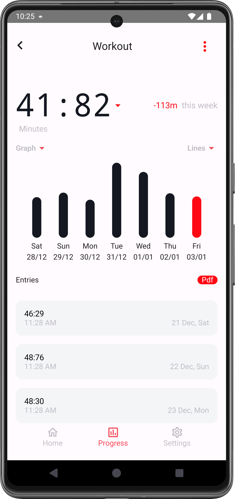

# Trackmate  

Trackmate is a productivity app designed to help users efficiently manage tasks and schedules. This project served as a learning experience for implementing advanced Android development techniques.  

## Features  
- **Custom UI Components**: Trackmate features a fully customized and intuitive user interface.  
- **Task Scheduling**: Leveraged the Android `AlarmManager` for managing task reminders.  
- **Room Database**:  
  - Multiple tables with foreign key relationships.  
  - DTOs for efficient data transfer between entities.  
- **Dependency Injection with Hilt**: Simplified dependency management for better scalability.  


## Screenshots  
| Home Screen | Notification | Progress Screen |  
|-----------|-----------|-----------|  
|  |  |  |  


## Technologies Used  
- **Language**: Kotlin  
- **Framework**: Android Jetpack  
- **Libraries**:  
  - Hilt for Dependency Injection  
  - Room for local database management  
  - AlarmManager for task scheduling  

## Getting Started  

To run this project locally, follow these steps:  
1. Clone the repository:  
   ```bash
   git clone https://github.com/your-username/trackmate.git
